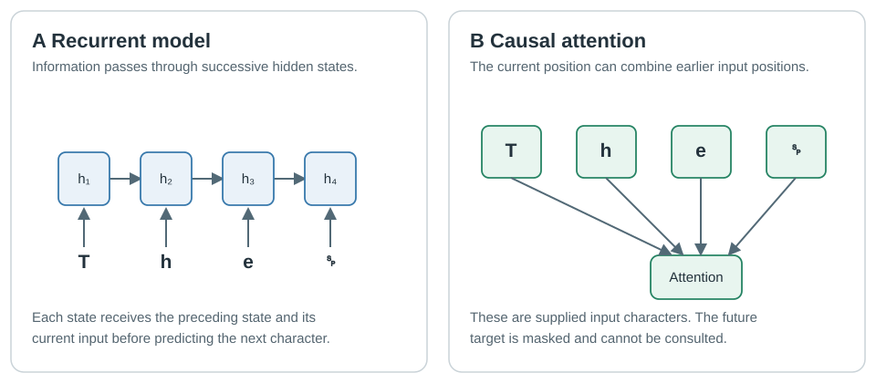

# min-char-transformer in base R

A small, CPU-only **decoder-style character Transformer** written directly in R.
This is the next learning project after [Karpathy's minimal character RNN](https://gist.github.com/karpathy/d4dee566867f8291f086):
the task is still to predict the next character of Tiny Shakespeare, but the
network uses **causal self-attention** in place of a recurrent hidden state.
Character/position embeddings, the attention block, layer normalisation,
feed-forward network, cross-entropy loss, backward pass and Adam updates are
implemented explicitly with base R matrices. There is no Python bridge,
pretrained model, GPU, packaged neural network or automatic differentiation.
`ggplot2` is optional and used **only** to create plots.

This is deliberately a single-head, single-block educational Transformer,
not a reproduction of GPT-2 or a demonstration of modern large-model performance.
The objective is to make the numerical mechanism and experimental evidence
inspectable in one small repository.

<picture>
  <source media="(max-width: 600px)" srcset="docs/figures/transformer_model_mobile.svg">
  
</picture>

## Quick test and run

From the repository root, with `Rscript` available:

```sh
Rscript tests/test_model.R
Rscript tests/test_gradients.R
Rscript tests/test_training.R
Rscript experiments/run.R --smoke --no-plot
```

The smoke run trains on bundled `data/input.txt` without downloading anything.
To run a short **real-text** experiment with live figures, install optional
`ggplot2` (version 3.4 or later) and start training:

```r
install.packages("ggplot2")
```

```sh
Rscript experiments/run.R --iterations=2000
```

The runner downloads Tiny Shakespeare on the first normal run if its file is
missing. With no plotting package, use `--no-plot`. The 2,000-update command is
an initial experiment, not a guaranteed training time or quality target.

## How this model predicts the next character

The input supplies its own targets. For example, the characters `The king`
provide the consecutive pairs `T → h`, `h → e`, `e → space`, and so on. The
model receives **the present and preceding input characters**, but it must
never inspect a character it is supposed to predict.

The programme maps characters to deterministic, one-based R indices. Each
character index selects a learned vector; a second learned vector identifies
its position within the current context. With context length `L` and embedding
width `d`, the result is a matrix `X` with `L` rows and `d` columns.

The model normalises those representations and constructs **queries**, **keys**
and **values**. Attention compares each query with every permitted key, then
uses the resulting weights to combine the corresponding values:

```text
Q = X Wq                K = X Wk               V = X Wv
A = row_softmax(Q Kᵀ / sqrt(d) + causal_mask)
Z = A V
```

The causal mask sets scores for *future* positions to negative infinity before
the softmax. A position may attend to itself and earlier input positions; the
upper triangle of its attention matrix is therefore exactly zero. The model
adds the attention output to its input through a residual connection, applies a
small position-wise feed-forward network through a second residual connection,
and projects the resulting representations to next-character probabilities.
The precise layer order and the manually derived gradients are documented in
[Attention and gradients](docs/02_attention.md).

Training evaluates the probability of each **actual next character** using
cross-entropy, differentiates every trainable matrix by hand, clips the global
gradient norm when needed and updates the parameters with a hand-coded Adam
optimiser. Generation works differently: it samples a predicted character,
appends it to its own prompt and repeats using only the most recent context.

## Requirements and model configuration

The model, training runner and tests require base R and the standard `tools`
package. Training uses CPU matrix operations; only plotting needs `ggplot2`.
There are no hidden package imports in the model implementation.

The reference configuration is a **32-character context**, **32-dimensional
embeddings**, **one attention head**, **one pre-normalised Transformer block**
and a **64-dimensional feed-forward layer**. With a 65-character vocabulary,
this specific untied-output implementation has **13,729 parameters**. The
runner calculates and records the actual count for the input vocabulary.
The model uses learned absolute positions, a ReLU feed-forward activation and
three layer-normalisation operations. There is no dropout or weight tying.

For a custom UTF-8 file or a changed *new-run* configuration:

```sh
Rscript experiments/run.R \
  --input=data/my_input.txt \
  --context-length=32 \
  --embedding-size=32 \
  --feedforward-size=64 \
  --lr=0.001 \
  --iterations=2000 \
  --seed=42
```

The input must be large enough for non-overlapping evaluation passages, and
its held-out characters must be present in the training vocabulary. For a
small custom corpus, reduce `--n-passages` and `--passage-chars` (the latter
must be a multiple of context length). See `--help` for all CLI options.

## Monitoring and interpreting a run

Each experiment creates a timestamped directory under `output/`. The console
and `experiment.log` record the configuration, dataset sizes, training progress,
elapsed time, ETA, validation measurements and checkpoint updates. Open the
run's `training.html` in a browser to watch the curves refresh independently
of training. `samples.txt` records generated text at selected updates.

With plotting enabled, the runner produces `training.png`, a separately laid-out
`training_mobile.png`, `validation_detail.png` and `attention.png`. The last
figure displays actual attention weights computed from the current checkpoint.
To recreate plots from recorded metrics:

```sh
Rscript experiments/plot_results.R output/YOUR_EXPERIMENT_DIRECTORY
```

**Loss is measured in nats per character; lower is better.** A uniform
predictor has loss `log(vocabulary_size)`. The runner also evaluates an
add-one-smoothed character bigram baseline fitted on the training split only.
The training curve is exponentially smoothed loss from training windows.
Validation is the average loss over fixed held-out passages and is not smoothed;
the two lines are not identical estimators of generalisation error.

The input is split contiguously into **80% training, 10% validation and 10%
test**. Validation selects eight non-overlapping passages of 256 transitions
by default; each passage is evaluated in disjoint context-sized windows with
context reset at each window boundary. The test portion is never evaluated
by routine training or checkpoint selection. After finalising the training
procedure, run the selected checkpoint on held-out test passages **once**:

```sh
Rscript experiments/run.R \
  --resume=output/YOUR_EXPERIMENT_DIRECTORY \
  --iterations=YOUR_COMPLETED_TOTAL \
  --test
```

`--test` refuses to overwrite an existing `test_results.rds` in that run. Avoid
using its result to tune the model and then reporting it as untouched test data.
See [Validation protocol](docs/03_validation.md).

## Stop, resume and saved files

To stop cleanly at the next training update, create a marker in the active run:

```sh
touch output/YOUR_EXPERIMENT_DIRECTORY/STOP
```

Remove it before resuming. `--iterations` always means the **new total target**:

```sh
rm output/YOUR_EXPERIMENT_DIRECTORY/STOP
Rscript experiments/run.R \
  --resume=output/YOUR_EXPERIMENT_DIRECTORY \
  --iterations=10000
```

A complete checkpoint saves the optimiser moments, training-window order and
position, random-number state, metrics and model parameters. `model.rds` alone
cannot resume training. Dataset checksum and model-defining settings are checked
before resumption; only reporting intervals, plotting and the total update
target may change.

| Output | Meaning |
|---|---|
| `metrics.csv`, `validation_passages.csv` | Aggregate and passage-level measurements |
| `experiment.log`, `metadata.rds` | Human-readable log and machine-readable run configuration |
| `samples.txt`, `attention_snapshot.rds` | Saved generated passages and model-derived attention |
| `best_model.rds` | Lowest measured validation-loss checkpoint |
| `model.rds` | Final or most recently stopped model parameters |
| `latest_checkpoint.rds` | Full training state required for resumption |
| `vocab.rds` | Character-to-index mapping |
| `training.html`, `*.png` | Optional local monitoring and figures |
| `FINISHED` | Normal completion marker; removed on resumption |

The original downloaded corpus, checkpoints, logs and full experiment outputs
are excluded from Git. Publication figures should be copied to `docs/figures/`
only after checking that they correspond to the documented reference run.

## Code and documentation

| Path | Purpose |
|---|---|
| `R/data.R`, `R/evaluation.R` | Text, vocabularies, split-safe windows and fixed evaluation |
| `R/model.R` | Full forward pass, manual gradients, loss, generation and gradient checker |
| `R/optimiser.R` | Explicit Adam moments, updates and global-norm gradient clipping |
| `R/progress.R` | Readable logs, progress, atomic file writes and isolated sampling RNG |
| `R/plots.R` | Optional desktop/mobile curves and attention heatmaps |
| `experiments/` | Training, replotting and saved-model attention inspection |
| `tests/` | Model, gradient, toy-training and monitoring checks |
| `docs/` | Historical context, worked mathematics, evaluation and results guidance |

For the architectural comparison, see [RNN versus Transformer](docs/05_rnn_comparison.md).
The RNN can carry hidden state across training windows while this Transformer
only sees its supplied context; the two models also differ in parameter count,
training split and optimiser. Historical curves must not be called a controlled
head-to-head benchmark without retraining and standardising those conditions.

## References and attribution

The attention equation and masked decoder concept follow Vaswani *et al.*,
[Attention Is All You Need](https://arxiv.org/abs/1706.03762) (2017).
The earlier project follows Karpathy's
[min-char-rnn](https://gist.github.com/karpathy/d4dee566867f8291f086)
and [2015 article](https://karpathy.github.io/2015/05/21/rnn-effectiveness/).
GPT-2 is a much larger decoder-only Transformer language model; this repository
teaches a related architectural mechanism but does not reproduce its model or
training procedure. No claim is made that this is the first R Transformer.
