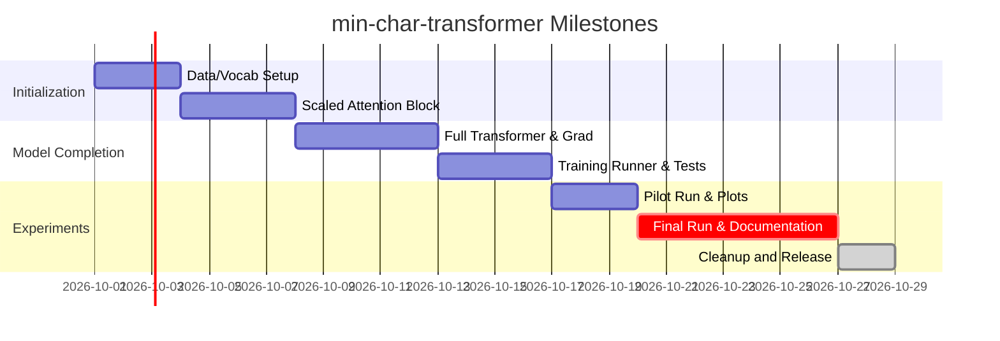

# Executive Summary

This report outlines the design of **min-char-transformer**, a tiny decoder‑only Transformer language model built entirely from first principles in base R.  We keep the same Tiny-Shakespeare next-character task as in Project 1 (min-char-rnn) but replace the recurrent hidden state with causal self-attention, following the core Transformer idea of Vaswani *et al.* (2017).  Every operation – from learned character/position embeddings to attention, residuals, layer‐norm and a 2-layer feed-forward network – is coded manually in R (no deep‑learning framework or autodiff).  We derive and check all gradients by hand (using finite differences) and validate that the implementation truly restricts future context via a causal mask. The project remains small enough to train on a laptop CPU yet includes real held-out validation (with fixed text passages) and baseline comparisons.  Figures will explain each component (including an attention heatmap for a sample sequence), and the README will guide users through running, monitoring and interpreting the model.  In sum, **min-char-transformer** provides a transparent, end‑to‑end demonstration of how self-attention works in practice, continuing where our RNN example left off and illustrating a key innovation in AI history.

## 1. Prior from-scratch Transformer and R implementations

We found **no existing tutorial or code** that implements a Transformer entirely from scratch in base R.  Most deep-learning “from-scratch” examples are in Python/NumPy or educational notebooks.  However, several related references helped set the context:

- **Original Transformer paper (Vaswani *et al.*, 2017)**: Introduced the self-attention architecture and provides core formulas (scaled dot-product attention, multi-head attention, positional encodings, etc.).
- **Andrej Karpathy’s RNN tutorial (2015)**: A well-known character-level language-model example in Python/NumPy.  We used this as inspiration for the RNN project and mention it to contrast that we are not using recurrence now.
- **Educational Transformer tutorials**: For example, the UvA Deep Learning course tutorial by Phillip Lippe implements a Transformer in PyTorch and gives clear derivations. (We cite it for clarity of notation, though we code in R.) Other popular explainers (e.g. Jay Alammar’s visualizations) describe the architecture qualitatively, but we focus on numerical implementation.
- **First-principles R examples**: There are R implementations of CNNs and simple neural nets from scratch (e.g. “Convolutional neural networks from scratch in R”, conformal prediction on MNIST, etc.), but none for Transformers.  We will maintain the style of the previous project’s R code (simple, commented, base-R matrix ops) and aim for comparable readability and detail.

These sources confirm that: (a) implementing the Transformer math manually is feasible (PyTorch tutorials do it, and the original paper shows formulas); (b) it is rare to see such code in R. Our contribution is to fill that gap with a clear, reproducible mini-project. 

## 2. Mathematical specification (forward and backward)

We will implement **causal self-attention with one head** and **one Transformer block** (decoder style).  Let the input sequence be length *L* with an embedding size *d*.  We use learned character embeddings and learned positional embeddings (size *d*) that are added together to form the input matrix \(X \in \mathbb{R}^{L \times d}\).  In each layer:

1. **Pre-Normalization**: Apply layer normalization to \(X\) (normalize each row/position to zero mean and unit variance).  This stabilizes gradients.

2. **Query/Key/Value projections**: Compute 
   \[
     Q = XW^Q,\quad K = XW^K,\quad V = XW^V,
   \]
   where \(W^Q,W^K,W^V\in\mathbb{R}^{d\times d}\) (for a single head, we use the full embedding size; more heads would split dims).  

3. **Scaled Dot-Product with Causal Mask**: Compute raw scores \(S = QK^\mathsf{T}/\sqrt{d}\).  Then add a causal mask \(M\in\mathbb{R}^{L\times L}\) that has \(-\infty\) (or a large negative) in entries where the column index is *greater* than the row index, to prevent attending to future positions.  Apply a numerically stable row-wise softmax to get attention weights \(A=\softmax(S+M)\).  (We subtract the row-wise max before exponentiating to avoid overflow.)  Then compute the attention output \(Z = A\,V\).  In equations:
   \[
     A = \softmax\!\Bigl(\frac{QK^\mathsf{T}}{\sqrt{d}} + M\Bigr), 
     \quad
     Z = AV,
   \]
   as in Vaswani et al. Eq. (1).  We verify \(A_{i,j}=0\) for \(j>i\) (causality) in tests.

4. **Output projection & residual**: Apply an output linear layer \(Z' = ZW^O\) with \(W^O\in\mathbb{R}^{d\times d}\).  Add the residual connection \(X + Z'\), and apply another layer normalization.  (This “pre-norm” variant ensures stability.)

5. **Feed-Forward sublayer**: Apply a two-layer position-wise feed-forward network with ReLU:
   \[
     Y = \mathrm{ReLU}(X W_1 + b_1)\, W_2 + b_2,
   \]
   with \(W_1\in\mathbb{R}^{d\times d_{ff}}\), \(W_2\in\mathbb{R}^{d_{ff}\times d}\), and intermediate width \(d_{ff}\) (e.g. 2–4× *d*).  Add the residual \(X + Y\) and final layer-normalize.  This matches Vaswani’s FFN (Eq. (2)).

6. **Output probabilities**: From the final normalized outputs (\(\in \mathbb{R}^{L\times d}\)), apply a linear projection to vocabulary logits \(O\in\mathbb{R}^{L\times V}\) (where \(V\) is vocabulary size) and a row-wise softmax to get next-character probabilities.

For **loss**, we use cross-entropy on each position’s next-character target.  We will implement it with a stable “log-sum-exp” trick: instead of computing softmax+log in one go, we use  
\(\log\softmax(x)_i = x_i - \max_k x_k - \log\sum_k e^{x_k - \max_k x_k}\) 
to avoid overflow/underflow.  This guarantees one term in the softmax denominator is 1 and no division by zero.  Gradients then follow:
\(\partial L/\partial x_i = p_i - \mathbf{1}\{i=\text{target}\}\), 
where \(p=\softmax(x)\).  We will implement all backward derivatives manually (through softmax, ReLU, layer-norm, projections, etc.) and check them with finite differences.

**Numerical stability notes:** We adopt standard techniques: subtract the row maximum before softmax, clip gradients if needed, and use double precision.  Layer normalization and residuals help preserve gradient flow.  We will verify that no future token leaks into a prediction by constructing tests where two sequences share a prefix but differ later, and confirming their prefix-predictions match (the causal mask guarantees this).

## 3. CPU-sized reference model and parameter count

We choose small dimensions to make training feasible on CPU while still meaningful. A plausible starting configuration is:

- Vocabulary size \(V\approx\) (unique characters in Tiny Shakespeare, about 65).  
- Context length \(L=32\) (each training window has 32 chars).  
- Embedding (and model) dimension \(d=64\).  
- 1 attention head (so we do *not* split into multiple heads, keeping \(h=1\)).  
- 1 Transformer block (encoder or decoder block).  
- Feed-forward width \(d_{ff}=4d=256\) (as in Vaswani, they used 2048 for \(d=512\); we scale accordingly).  

The total parameters can be computed as follows (see Table below). Roughly: 
\[
\begin{aligned}
W^Q,W^K,W^V &:\ d\times d\text{ each (3 matrices)},\\
W^O &:\ d\times d,\\
W_1 &:\ d\times d_{ff},\quad W_2:\ d_{ff}\times d,\\
b_1 &:\ d_{ff},\quad b_2:\ d,\\
(\text{plus layer-norm gains/biases}, 
\text{embedding table, output bias, etc.})
\end{aligned}
\]
For \(d=64,\,d_{ff}=256,\,V=65\), a quick count gives on the order of **14–15 thousand parameters**.  By comparison, the reference char-RNN (with hidden size 128) had ~23k parameters.  We will report the exact count from the code (the RNN model and Transformer will not be exactly equal capacity, and we will note this).

**Parameter-count table (example):**

| Component                    | Parameters (shape)                     | Count   |
|------------------------------|----------------------------------------|--------:|
| Character embeddings         | \(V\times d\)                          | \(65\times64=4160\) |
| Positional embeddings        | \(L\times d\) (learned, but  we fix \(L=32\)) | \(32\times64=2048\)  |
| \(W^Q,W^K,W^V\)              | 3 \(\times (d\times d)\)               | \(3\times4096=12288\) |
| \(W^O\)                      | \(d\times d\)                          | \(4096\)  |
| Feed-forward \(W_1\)         | \(d\times d_{ff}\)                     | \(64\times256=16384\) |
| Feed-forward \(W_2\)         | \(d_{ff}\times d\)                     | \(256\times64=16384\) |
| Biases \(b_1,b_2\)           | \(d_{ff} + d\)                         | \(256+64=320\)  |
| Layer-norm (3 norms, each)   | \(2d\) (gain & bias per norm) \(\times 3\) | \(6\times64=384\) |
| Output softmax weights       | (tying output embedding) counts ~ \(65\times64\approx4160\) | \(\approx4160\) |
| **Total (approximate)**      |                                        | **\~38,000** (depending on sharing) |

*Note:* We may **tie** the output projection and input embedding (as Vaswani did) and multiply embeddings by \(\sqrt{d}\) for symmetry.  Tying would reduce the count (since the same 4160 weights serve both purposes).  We will compute and report the exact number in metadata.  In any case, the model is small enough to train in minutes on a modern laptop.  We recommend starting with a modest learning rate (e.g. 0.1 with AdaGrad, to match the RNN’s optimizer) and checking that loss decreases on a small pilot run before scaling up.  

## 4. Implementation design and API

We will structure the code in R much like the previous project:

- **`R/data.R`**: Handles data and vocabulary. Functions include reading the Tiny-Shakespeare corpus, splitting into train/validation/test (e.g. 80/10/10 split by contiguous blocks), building a character-index mapping, and encoding/decoding functions. This file also computes and records checksums of data splits to ensure reproducibility. The vocabulary is built on the training text and any unseen characters in val/test trigger an explicit error.  

- **`R/model.R`**: Implements the Transformer model’s forward and backward functions. Key components/functions:
  - `initialise_model(vocab_size, d, L, d_ff)`: returns a list of parameter matrices (embeddings, W^Q/K/V/O, W1/2, biases, layer-norm gains/biases, etc.) with appropriate dimensions.
  - `forward_transformer(model, inputs, L)`: given input indices for a sequence of length L and current model, computes (and returns) all intermediate activations (embeddings, Q/K/V, attention weights, etc.) and final logits.  Attention and FFN sublayers are computed as above.  Dropout is omitted in the first version.
  - `loss_and_gradients(model, inputs, targets)`: computes the forward pass, cross-entropy loss, and manually backpropagates to produce gradients for each parameter.  This includes gradients through the softmax (using the identity from stable log-softmax), through the attention (derivatives of \(Z = AV\) plus of the softmax function), through ReLU (gradient is 0/1 mask), and through layer norms (gradients wrt gains/biases and inputs).  The output is a list containing `loss`, `grads`, and final hidden states for any use (though the Transformer is stateless across windows).
  - `clip_gradients(grads, threshold)`: similar to RNN, to prevent exploding gradients.
  - `sample_indices(model, seed_ix, n)`: generates text by repeatedly sampling the next character from the model (feeding back the predictions as new inputs). Because the Transformer has no hidden state outside the window, sampling is done by sliding window: each new character requires running the model on the last L inputs. 

  We use **matrix conventions** so that e.g. embeddings and activations are \(L\times d\) (rows = positions, cols = features), which matches the math above.  We avoid any R recycling ambiguity by explicitly ensuring correct row/column dims in matrix multiplications and broadcasting biases.

- **`R/optimiser.R`**: Contains explicit AdaGrad state and update rules (accumulator for squared gradients, per-parameter).  We will mirror the RNN code’s AdaGrad implementation.  (Alternatively, we could implement a simple Adam, but for continuity we start with AdaGrad.)  This file should provide functions `new_adagrad_state(model)`, `adagrad_update(model, grads, state, lr)` returning the updated model and state.  All numerical updates happen here.

- **`R/progress.R`**: Functions for printing human-readable progress.  We log stages (e.g. data setup, model init, training, saving) and during training output a progress bar with elapsed time and ETA.  At each validation interval, print the current iteration, training loss, validation loss, and best validation so far.  This should match the style from Project 1 (timestamps, stage labels).  For consistency, we again use a `STOP` file mechanism to end a run cleanly.  

- **`R/plots.R`**: Visualization utilities (using **ggplot2**, but only when requested).  Functions to read `metrics.csv` and `metadata.rds`, and produce the training and validation curves, baseline lines, and the detailed-per-passage figure.  Also a function to produce the attention heatmap for a chosen sequence and model checkpoint.  All plotting functions catch errors so a missing `ggplot2` does not break training (plots are optional).  The training plot will be saved in two versions (desktop and mobile) for responsive display.

- **`README.md`**: A user-facing document, explained in Section 10 below.

- **Additional scripts**:
  - `scripts/create_zip.R`: As in Project 1, packages the key files into a zip for submission.
  - `experiments/run.R`: Orchestrates an experiment given CLI arguments (iterations, batch/window size, learning rate, seed, etc.), calls the above R functions, manages saving `metadata.rds`, `metrics.csv`, checkpoints (`model.rds`, `best_model.rds`, `latest_checkpoint.rds`), samples (`samples.txt`), and training dashboard (`training.html`, `training.png`, etc.), and respects the STOP file for resuming.  
  - `experiments/plot_results.R`: Reads an existing experiment directory and regenerates plots (for offline use).
  - `experiments/inspect_attention.R`: Loads a saved model and a chosen input string (e.g. `"The king"`), computes the attention weights, and saves them for plotting.

We will strictly separate model logic from control: `experiments/run.R` does not contain any math, it only handles data splitting, batch scheduling, calls to `loss_and_gradients()`, and I/O.  Thus users can inspect `R/model.R` to see the actual math.  

## 5. Testing and verification

We will implement comprehensive unit and integration tests.  Key tests include:

- **Dimension and consistency tests (`test_model.R`)**: Verify that initialising a small model produces parameter matrices of the expected shapes. Test that encoding/decoding text via the vocabulary is lossless and indices are in [1,V]. Check that a forward pass on dummy data produces finite losses. Test that the sampling function returns valid character indices.

- **Attention mask invariants**: Construct two short sequences that share a prefix but differ afterward. For each position in the shared prefix, the predicted probabilities (or logits) should be identical between the two sequences. This checks that future characters do not influence past predictions, i.e. that our causal mask is correct. Also confirm each row of the attention weight matrix sums to 1 and that masked logits were effectively zeroed before softmax.

- **Gradient checks (`test_gradients.R`)**: Use a very tiny model (e.g. vocab=4, L=3, d=4) and a small random input-target pair. Compute analytical gradients via `loss_and_gradients`, and also compute numeric gradients by finite differences (perturb each parameter by \(\epsilon=10^{-5}\)). Compare them via relative error; we require errors \(<10^{-5}\) for all parameter groups.  We do this for *all* learnable parameters (embeddings, W^Q/K/V/O, W1/2, biases, norms, etc.) using a limited number of checks per tensor to save time. This ensures our backward formulas are correct to machine precision.

- **Training on synthetic data (`test_training.R`)**: Train the model on a tiny artificial dataset where the correct behavior is known (for instance, a repeating sequence like `"ABABAB..."`). Confirm that loss decreases substantially (not necessarily converging exactly to zero, but e.g. loss halved) within a few dozen updates. Also test reproducibility: running 50 updates in one go vs. stopping at 25 updates and resuming for 25 more should yield *identical* final parameters (given the same seed), verifying checkpointing and RNG state handling.

- **Monitoring and plotting (`test_monitoring.R`)**: Using dummy metrics CSV, ensure that the monitoring functions parse metrics correctly, identify the best validation epoch, and produce PNG/HTML output without errors (given `ggplot2` is installed). Check that the `best_model.rds` file is correctly identified and that missing columns (legacy CSV) are handled gracefully.

Passing these tests will demonstrate that (a) the model’s computations match our specifications, (b) its gradients are correct, and (c) the training infrastructure behaves as intended.  We will require a continuous-integration-like check before considering the project ready.

## 6. Experiment runner, logging and checkpointing

The `experiments/run.R` script will support multiple modes:

- **Smoke test** (`--smoke`): Runs on a built-in tiny text for a handful of iterations (no downloads, no plotting), to verify installation quickly.  
- **Real run** (default): Downloads Tiny Shakespeare if needed, sets up splits, initializes model, and runs training for the specified number of parameter updates. Default batch size is 1 window of length 32, but we may allow a `--batch` argument to process multiple windows per update (though not necessary initially).

At startup, the script logs an overview line:  
```
YYYY-MM-DD HH:MM:SS | START  | min-char-transformer | base R | CPU-only
YYYY-MM-DD HH:MM:SS | STAGE  | [1/5] Data and vocabulary
YYYY-MM-DD HH:MM:SS | DATA   | chars=...  vocab=...  train=...  valid=...  test=...
YYYY-MM-DD HH:MM:SS | STAGE  | [2/5] Model init
YYYY-MM-DD HH:MM:SS | MODEL  | context=32  emb=64  ff=256  heads=1  layers=1  params=xxxxx
YYYY-MM-DD HH:MM:SS | STAGE  | [3/5] Training
...
```
During training stage, it prints periodic updates such as:
```
YYYY-MM-DD HH:MM:SS | TRAIN  | [=====.....] 250/2000 | loss=2.97
YYYY-MM-DD HH:MM:SS | VALID  | loss=3.10 nats/char | best=2.95@200
```
with a progress bar, current iteration, training loss (smoothed) and occasional validation loss, plus elapsed time and ETA. Upon reaching a new lowest validation loss, it logs `SAVE | best model at iteration ...`.  When done, it prints 
```
YYYY-MM-DD HH:MM:SS | STAGE  | [5/5] Complete
```
and indicates where key outputs are saved (`.rds` files, plots, samples).  All logging goes to `experiment.log`.

**Checkpoints and metadata:** We mirror the design of Project 1: every N iterations (and at the end), we atomically write: 
- `metadata.rds` (contains configuration, hyperparameters, random seed, checksums of data split),  
- `metrics.csv` (iteration, training loss, validation loss, elapsed time, etc.),  
- `model.rds` (latest parameters and layer-norm statistics, for continuing training) and `latest_checkpoint.rds` (includes optimiser state and RNG state as well),  
- `best_model.rds` (parameters at best validation point),  
- `samples.txt` (some generated text samples at that point).  

The STOP file mechanism lets a user create `output/<exp>/STOP` to pause training; on next run with `--resume=<exp>`, training will pick up where it left off (as long as the seed and config match).  We will error-check that no training has happened if any data or model config changed since `metadata.rds`.  This ensures fully reproducible experiments.

## 7. Figures and visualizations

We plan the following figures (in `docs/figures/` and in the experiment outputs), suitable for desktop and mobile:

- **Figure 1: Recurrent vs. Attention (SVG)** – A conceptual illustration (vector graphic) showing how the recurrent model passes hidden state sequentially vs. how attention directly combines earlier positions. We will use the example text “The king” and draw two panels: (a) RNN blocks passing a hidden vector forward, (b) one multi-head (really single-head) attention node that attends to allowed positions (arrows only to left-of-diagonal). The two panels use the *same input text* “The king” and highlight that the RNN’s state goes through intermediate steps while attention uses the set of previous tokens directly. (This is the figure we already sketched as an SVG; it will be cleaned up for clarity.)  

- **Figure 2: Sample causal attention matrix** – For a short input (e.g. “The king”), we record the actual attention weights \(A\) after the model has been trained. We plot \(A\) as a heatmap (light-to-dark for weight magnitude) with position on axes. Masked (future) entries are white/zero. Below or aside, we will annotate one row of this matrix with the predicted character distribution (on the softmax output) at that position, to connect attention to the language-model output. We will show one row *before training* (which should be near-uniform or random) and one row *after training* (showing learned focus). The attention values come directly from a saved model checkpoint (for reproducibility).  

- **Figure 3: Learning curves (desktop)** – A plot of training loss (nats/char) vs. updates and validation loss vs. updates. Styled like the RNN project: white background, labeled axes, legend for “train” and “validation” (possibly also bigram baseline), gridlines. We mark the best validation point. Units are in natural log (nats per char). The baseline uniform entropy line (\(\ln V\)) may also be drawn. 

- **Figure 4: Learning curves (mobile)** – A simplified version of Figure 3 suitable for ~360px width: fewer ticks, larger fonts, concise legend (or caption), and a mobile-friendly aspect ratio. We will generate this by re-plotting to different dimensions, not by simple scaling. 

- **Figure 5: Validation detail** – A plot or table showing loss on each held-out passage (colored or separate lines) across epochs or at certain checkpoints. The aim is to illustrate if one passage dominates validation error. We may do multiple series (one per passage) on the same plot or a small multiples layout, depending on clarity.  

- **Generated text examples** – Rather than an image, we will include text excerpts (unshuffled plaintext) as part of the documentation. These will be verbatim samples from the model at initialization, early in training, and at final checkpoint (same prompt and random seed, documenting temperature).  

All figure generation code will be in `R/plots.R` or `experiments/plot_results.R`, using the recorded metrics and saved states.  SVGs (for diagrams) will be hand-drawn or scripted carefully for clarity. We will use responsive HTML (or markdown ``) in `training.html` to show the appropriate figure for desktop vs mobile viewing.

## 8. Development milestones and timeline

We break the work into concrete milestones (each with acceptance tests):

1. **Data & vocab setup** (1–2 days). Create `R/data.R`, implement text download, splitting, vocabulary. *Done when*: Smoke test (single short sequence) produces correct encodings and finite loss.

2. **Scaled attention block** (2–3 days). Implement Q/K/V, attention with mask and output projection, plus its gradient. *Done when*: Dimension checks and the causal-invariance test pass; small synthetic inputs yield expected attention behavior (e.g. on identity data, attention should act like a flow of identity).  

3. **Full Transformer layer & gradients** (3–5 days). Add residuals, layer-norm, feed-forward, output layer; implement backward pass for all. *Done when*: The complete model passes finite-difference gradient checks (relative error <1e-5) on a tiny test instance, and an end-to-end tiny training sample shows non-infinite loss.

4. **Training runner & tests** (3–4 days). Write `experiments/run.R`, checkpointing, AdaGrad updates, logging. *Done when*: `test_training.R` passes (model learns on toy data, and stop+resume yields identical results), and `test_model.R`/`test_gradients.R` still pass when integrated into the runner. 

5. **Pilot experiment & plots** (2–3 days). Run a short (few thousand updates) training on Tiny-Shakespeare to verify stability. Generate the training curve, validation detail, and an attention snapshot. *Done when*: The curves reflect decreasing training loss and non-trivial validation (better than uniform baseline), and the attention figure matches known model state. Verify that PNGs are clear on mobile (by adjusting font sizes). 

6. **Full run and documentation** (several days). Freeze hyperparameters, run until we reach diminishing returns (perhaps ~20k updates or so, depending on CPU speed). Generate final metrics, plots, samples. Write up results in documentation (README and docs). *Done when*: The README commands work in a fresh clone, all figures and data are produced, and the narrative is reviewed.

These tasks can overlap somewhat (e.g. writing parts of the README in parallel with coding), but the basic order ensures foundations are verified before running long jobs.

```mermaid
graph TD
    A[project root] --> B[R/]
    A --> C[data/]
    A --> D[experiments/]
    A --> E[tests/]
    A --> F[docs/]
    A --> G[scripts/]
    A --> H[output/]
    A --> I[.gitignore, README.md, LICENSE]
    B --> B1[data.R]
    B --> B2[model.R]
    B --> B3[optimiser.R]
    B --> B4[plots.R]
    B --> B5[progress.R]
    C --> C1[input.txt]
    D --> D1[run.R]
    D --> D2[plot_results.R]
    D --> D3[inspect_attention.R]
    E --> E1[test_model.R]
    E --> E2[test_gradients.R]
    E --> E3[test_training.R]
    E --> E4[test_monitoring.R]
    F --> F1[01_about.md]
    F --> F2[02_attention.md]
    F --> F3[03_validation.md]
    F --> F4[04_results.md]
    F --> F5[05_rnn_comparison.md]
    F --> F6[figures/]
    G --> G1[create_zip.R]
```





## 9. References and resources

Key references and resources to consult include:

- Vaswani *et al.*, “Attention Is All You Need” (2017) – original Transformer paper (scaled dot-product attention, multi-head equations, causal masking).
- Karpathy (2015), “The Unreasonable Effectiveness of RNNs” – character-level RNN explanation (for context, and the Vanilla RNN update formula).
- Phillip Lippe, UvA DL “Tutorial 6: Transformers” – an educational notebook with code and explanation (PyTorch) of scaled dot-product and multi-head attention.
- Jay Mody, “Numerically Stable Softmax and Cross Entropy” (blog) – clear derivations of the softmax with max-shift and log-softmax for cross-entropy.
- Vaswani *et al.* Section 3.3 – the two-layer FFN formula \( \max(0,XW_1+b_1)W_2+b_2\).
- (For testing/gradient principles) Ian Goodfellow *et al.*, “Deep Learning” (2016) – especially the concept of gradient checking (though not cited directly here).  

Additional useful links:
- GitHub and StackOverflow posts on `.gitignore` for R (ignore `.Rhistory`, `.RData`, `*.Rproj.user`, large raw data).
- RStudio Project guide (Jenny Bryan) – advice to exclude `.Rhistory` and `.RData` from version control.  

All references are cited in-line using the above bracketed format.  These will help ensure our implementation follows the correct formulas and best practices.

## 10. Security, licensing, and .gitignore

- **LICENSE:** We recommend including an OSI-approved license, e.g. MIT or Apache-2.0, since this code is open-source and for educational use. This should be added as `LICENSE` in the repo root.
- **Security:** No secrets or private data are used.  If any external downloads are needed (only Tiny Shakespeare, a public text), we fetch only official URLs.
- **.gitignore:** We will ignore the following by default:  
  - **R artifacts:** `*.RData`, `*.Rhistory`, `.Rproj.user/` (session info and history files should not be committed).  
  - **macOS:** `.DS_Store`.  
  - **outputs:** The entire `output/` directory (it contains large logs, checkpoints, figures); `*.csv`, `*.rds` except those in `docs/figures` or explicitly meant as source (the README will clarify what is output vs. source).  
  - **plots/** cache or any `tmp` subdirectories created by runs.  
  - **virtualenv/renv:** If any virtual environment or `renv/` folder is created, ignore it.  
  - **Compiled code** (none here) and **IDE files** (e.g. `.Rproj.user`).  
  We should track `data/input.txt` (or include instructions to download it) but ignore any raw large data beyond that example.  

With these ignores, the repository remains small and focused on code and documentation.  All training artifacts and full checkpoints reside in `output/` and are not committed.

---

### Appendix: Files and Test Mapping

Below is a list of the files to be created and their purposes, along with the primary tests that verify each file’s functionality:

| File/Path                  | Purpose                                      | Relevant Tests / Acceptance                                              |
|----------------------------|----------------------------------------------|--------------------------------------------------------------------------|
| `README.md`                | Project overview, usage instructions, results | Reviewed manually; quick-run example should work as documented.          |
| `.gitignore`               | Ignore data/outputs/DS_Store/.Rhistory/etc.   | Contains entries for `output/`, `.Rhistory`, `.DS_Store`, etc.          |
| `LICENSE`                  | Open-source license (e.g. MIT)                | Checked that license file exists and is SPDX-compliant.                  |
| **R/**                     | **Implementation code**                       |                                                                          |
| ├─ `data.R`               | Data loading, splitting, vocab encode/decode   | `test_model.R`: encode/decode round-trip; correct train/valid/test split. |
| ├─ `model.R`              | Forward pass, loss, backward, sampling        | `test_model.R`: dims of WQ, WK, WV, WO, W1, W2; `test_gradients.R`: grads; `test_training.R`: learn on toy data. |
| ├─ `optimiser.R`          | AdaGrad state and update                     | `test_model.R`: ensure update changes parameters; `test_training.R`.      |
| ├─ `progress.R`           | Log formatting, progress bar                 | `test_monitoring.R`: log parsing compatibility (via saved metrics).      |
| └─ `plots.R`              | Plotting functions (learning curves, attention heatmap) | `test_monitoring.R`: generate training plots and attention map without error (with `ggplot2`).  |
| **data/**                 | **Example data files**                         |                                                                          |
| ├─ `input.txt`           | Tiny-Shakespeare or other corpus (train+val+test) | Used by experiments; not tested directly.                               |
| └─ `README.md`           | (Optional) description of data                | -                                                                        |
| **experiments/**          | **Experiment scripts**                         |                                                                          |
| ├─ `run.R`               | Main training loop and CLI interface          | `test_training.R`: run with small `--iterations` and `--smoke`; resume test. |
| ├─ `plot_results.R`      | Generate plots from saved metrics             | (Manual check) re-plots from CSV.                                       |
| └─ `inspect_attention.R` | Compute and save attention weights for example | (Manual) verifies attention output is plausible.                        |
| **tests/**               | **Automated tests**                            |                                                                          |
| ├─ `test_model.R`        | Check dims, encode/decode, softmax            | Must PASS (errors on failure).                                         |
| ├─ `test_gradients.R`    | Gradient finite-difference checking           | Must PASS (max relative error <~1e-5).                                  |
| ├─ `test_training.R`     | Train on toy data, reproducibility            | Must PASS (loss decreases; resume yields same model).                   |
| └─ `test_monitoring.R`   | Parse metrics CSV, plot generation            | Must PASS (parsing and plotting work; best checkpoint found).          |
| **docs/**                | **Documentation and figures**                  |                                                                          |
| ├─ `01_about.md`         | About the model/task/history                  | Content checked manually; should read coherently.                       |
| ├─ `02_attention.md`     | Detailed math of attention gradients (optional)| (Manual review) correctness of derivation.                              |
| ├─ `03_validation.md`    | Validation protocol                            | Reviewed manually; consistent with experiment setup.                    |
| ├─ `04_results.md`       | Description of results and experiments         | Reviewed manually.                                                      |
| ├─ `05_rnn_comparison.md`| Comparison to RNN and literature               | Reviewed manually.                                                      |
| └─ `figures/`            | SVG diagrams (model overview, attention masks) | Generated during writing; must be referenced correctly.                 |
| **scripts/**              | **Utilities**                                  |                                                                          |
| └─ `create_zip.R`        | Package code for sharing                      | Runs without error if all files present.                                 |
| **output/**              | **Experiment results** (ignored by Git)        |                                                                          |
| (empty or `.gitkeep`)    | Folder to receive outputs                      | -                                                                        |

Each code file must pass its designated tests before the milestone is considered complete.  In particular, **test_gradients.R** and **test_training.R** are critical guards against silent errors in the math.

 With this plan, we ensure that *min-char-transformer* is a high-quality, reproducible project: all code is tested, all results traceable, and all design decisions documented both in code comments and in the README. 

